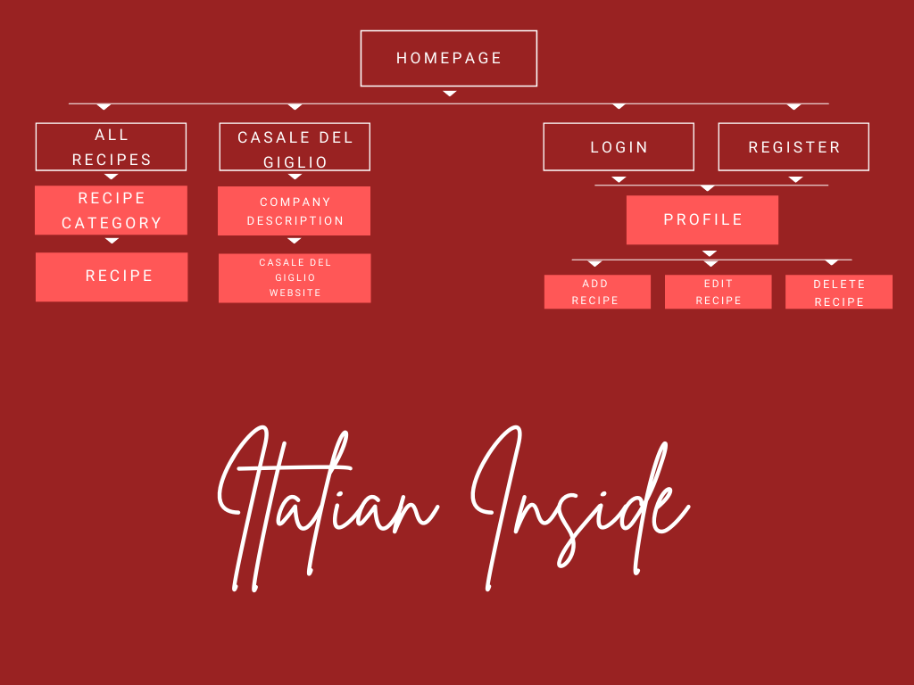

<h1 align="center">Italian Inside</h1>
<h2 align="center">Bite it - Taste it - Love it</h2>

The Coronavirus pandemic, kept us all in our houses for more than a year.
Many people had to find a way to cope with this new reality.
Someone found a new hobby, others started to study a new language and still others decided to make plans for the future.
I, honestly, did all of them, but something that many of the people I know did, is cooking; to experiment with new recipes and organize theme dinners with their household.

While [Googleing](https://www.google.com/) new recipes I discovered how difficult it is to find an authentic recipe. Many are just modified versions of the genuine one, with extra fats and less flavours.

A *cuisine* lover like me could not accept this so I decided to make my little part to change this.

I don't know much about other countries but I know a lot about Italy; that is how *Italian Inside* was born.

Italian Inside targets two main groups:

* Non-Italian people - To give them a place where to find authentic Italian recipes.
* Italian people - To give them the possibility to share their most precious recipes with the world.

Click [here](https://italian-inside-cookbook.herokuapp.com/) to have a look at Italian Inside.

---

# Table of contents

1. [User Experience](#User-Experience)
    - [Project Goals](#Project-Goals)
    - [User Stories](#User-Stories)
        - [Website](#Website)
        - [Homepage](#Homepage)
        - [All Recipes](#All-Recipes)
        - [Recipe View](#Recipe-View)
        - [Wine Company](#Wine-Company)
        - [Login / Registration](#Login-/-Registration)
        - [Profile](#Profile)
    - [Design](#Design)
        - [Color Use](#Color-Use)
        - [Fonts](#Fonts)
        - [Icons](#Icons)
        - [Images](#Images)
        - [Graphic Elements](#Graphic-Elements)
        - [Defensive Design](#Defensive-Design)
        - [Navigation](#Navigation)
    - [Use of Database](#Use-of-Database)
    - [Wireframes](#Wireframes)
2. [Features](#Features)
    - [Existing Features](#Existing-Features)
    - [Future Features](#Future-Features)
3. [Technologies Used](#Technologies-Used)
4. [Testing](#Testing)
5. [Deployment](#Deployment)
6. [Credits](#Credits)
    - [Content](#Content)
    - [Media](#Media)
    - [Code](#Code)
7. [Acknowledgements](#Acknowledgements)
8. [Disclaimer](#Disclaimer)

# User Experience

## Project Goals

This project is being submitted as the third Milestone Project in partial fulfillment of the Full Stack Developement Program at Code Institute.
The project has the goal to demonstrate my knowledge on front-end and back-end developement. Moreover it demostrates my knowledge of the CRUD functionality - Create, Read, Update and Delete.
The technologies required to be used are [HTML](https://en.wikipedia.org/wiki/HTML), [CSS](https://en.wikipedia.org/wiki/CSS), [JS](https://www.javascript.com/), [Python](https://www.python.org/), [Flask](https://flask.palletsprojects.com/en/1.1.x/) and [Mongo DB](https://www.mongodb.com/).

The website I decided to create is targeting all the users that enjoy cooking or have interest in that field. This application provides a service to both Non-Italian users (that can browse between authentic Italian recipes) and Italian users (that can spread their knowledge about Italian cuisine and learn about recipes from regions other than the one they belong to).
Italian Inside also provides a service to me, the developer, because it advertises the wines from the company "[Casale del Giglio](https://www.casaledelgiglio.it/en/)" abroad. The developer could recive, for example, a percentage for every bottle bought by Italian Inside users.

## User Stories

### Website

* As a website owner I want to create a website where users will be able to both find and share traditional Italian recipes.
* As a website owner I want to collaborate with a wine company so I can advertise their products on my website.

* As a user (not Italian) I want to be able to consult the website and find traditional Italian recipes so I can try to make them at home.
* As a user (Italian) I would like to share some traditional but not very known recipes of my region and learn about recipes from other regions.

### Homepage

* As a website owner I want my website to provide a service but also be fun, that is why I add a map of Italy that, when hovering on it, will reveal the name and the gastronomic specialties of every region.

* As a user, I would like to know more about italy, like some fun facts.

* As a website owner I want people to easily navigate, that’s why I will provide on every page a navigation bar and a footer with all the links to the pages.

* As a user I want to be able to easily access all pages of the website.

### All Recipes

* As a website owner, I want to be clear from the beginning the typology of recipes that are on the website. That is why for example, the recipes will have a different background per type and an icon (with tooltip) will inform the uder if the dish is vegetrian or not.

* As a user, if for example I am looking for a dessert, I want to go on the “All recipes” page and find the “Dessert” type recipes.

* As a website owner, I want the users to be able to find recipes easily; that is why I will add a search bar.

* As a user, if I am looking for a specific recipe I want to be able to find it by just typing its name in the search bar.

### Recipe View

* As a website owner I will display in the recipe page technical information about the recipe (type, difficulty, servings, ingredients) and how to prepare it step by step.

* As a user when I click on a recipe I want to find all the information I need to understand what kind of recipe it is and how to prepare it.

### Wine Company

*	As a web owner, I also want to make some profit, so I am collaborating with a wine company and advertising their wines on my website by pairing them with the recipes.

*	As a user, I want to know what is the best wine to pair with a recipe and buy a bottle of it.

### Login / Registration

*	As a website owner I want to allow people to have a personal profile so they can add or modify recipes besides viewing them.

*	As a user I want to have my personal access to the website so I can share my recipes with the other users.

### Profile

*	As a website user, in this page I will display for the user the list of the recipes they added and possibility to add more, modify or delete them.

*	As a user, I want to be able to review the recipes I uploaded, manage them and add more.

## Design

### Color Use

The entire website uses red as the main color. This is been chosen because red is often associated by the mind to food, as for example green to nature.
By browsing the website is easily noticible that more shades of red have been used.
The red scheme is being balanced by the use of black and white (for the text).

 

### Fonts

The main fonts used are Playfair Display and Roboto with a fallback of sans-serif. These fonts have been taken from [Google Fonts](https://fonts.google.com/).

I selected these fonts as, in my opinion, Playfair Display give an elegant and antique look to the website, this is why it is being used for the main titles and given them a bigger size.
Roboto instead, is easier to read and I prefered to use this font for those information that I want to be clear, like the steps of a recipe.
In some occasion, both fonts are using a **bold** or *italic* style to accentuate some words or to give some movement to a plain text.

 

### Icons

The icons used in this website are all taken from [Font Awesome](https://fontawesome.com/) and are used to improve the communication or to beautify a button or a tab.

### Images

The images used are taken from different sources:
* The categories in the "All recipes" pages, the background and the recipes pictures, are taken from [Pexels.com](https://www.pexels.com/) and [Pixabay](https://pixabay.com/it/), that provide images without copyright.
* The shortcut icon representing a slice of pizza is been taken from [Favicon.io](https://favicon.io/).
* The picture with the logo of ["Casale del Giglio"](https://www.casaledelgiglio.it/en/) is been taken from their website.

### Graphic Elements

The code for the interactive map used on the homepage is been realized by [Antonio Del Cin](https://codepen.io/Antoniox22/pen/oYRowJ) and then customized by me.
The code to add tooltips to the map is been written by [Naila Ahmad](https://codepen.io/nailaahmad/pen/bEBaxo).

### Defensive Design

In order to avoid the misuse of the website and its forms, some defensive mechanisms have been used:
* The login and register pages have a custom pattern applied to the username and the password field.
The username have to be between 3 and 20 characters and contain lowercase letters, uppercase letters or numbers.
Moreover it has to be unique.
The password instead, have to be between 5 and 20 characters and contain at least a digit, a special character, a lowercase and an uppercase letter.

* The form in the add and edit pages also include specific patterns in their fields:
The name of the recipe has to be between 3 and 200 characters.
The URL to include a picture has to start with "http://" or "https://" and be between 6 and 900 characters.
The number of servings input has to be maximum 2 characters long and include just numbers.
The name of the wine to pair with the dish has to be between 5 and 50 characters.
The ingredients have to be between 5 and 1000 characters; the user is also asked to write every ingredient on a different line.
The steps to realize the recipe have to be at least 5 characters long and the user is required to write every step on a new line.
All fields are required.

* When trying to delete a recipe (by clicking on the button with the bin icon in the Profile page), the user will trigger a modal that will ask the user again if he/she really wants to delete that recipe.

* There is a defensive 404 error page that will block anyone trying to access a page that require authentification, when they are not authentified.

### Navigation

Is really important for the website to be user friendly and to help users access the page they are looking for within maximum 5 clicks.
Below you can find the sitemap of Italian Inside.

## Use of Database

For this project I decided to use Mongo DB as database. Below you can find the structure of my six collections:

## Wireframes

My wireframes have been created with [Balsamiq](https://balsamiq.com/). Click on the links below to view them.

* [Desktop](./readme/wireframes/desktop-wireframe.pdf)
* [Tablet](./readme/wireframes/tablet-wireframe.pdf)
* [Mobile](./readme/wireframes/mobile-wireframe.pdf)

# Features

## Existing Features

* Navigation bar

From the navigation, the user can access to all main pages.
Moreover, the logo is also a link to the homepage.

In the mobile view, the menu can be accessed by clicking on the hamburger icon on the top right corner that acts as a hamburger menu button.
The menu will then scroll out from the right side.

* Footer

The footer includes an invitation to join the website and to contact us for any kind of communication. The email address inclued a link so by clicking it, it will open a new email with the "To:" already filled in.
It also includes the links to [Facebook](https://www.facebook.com/), [Instagram](https://www.instagram.com/) and [YouTube](https://www.youtube.com/).

* Homepage

The homepage includes an introduction to the website and an interactive map. By hovering on the map, every region will open a tooltip saying the name of that region and the products it is famous for.

* All recipes

This section contains a search bar to allow the user to search for a recipe by just typing it in.
It also contains a list of all the recipes divided by category.
Next to each recipe there will be an icon showing if that recipe contains meat, fish or if is vegetarian.

* Recipe

The recipe view displays the title with a picture and a few information about the recipe, like servings, difficulty level and ingredients.
Underneath the preparation of the recipe is displayed step by step.

* Casale del Giglio

In this page, there is a little explaination about the wine company. Moreover there is also a button linked to the website of the company.

* Profile

This page is accessible only after having registered or logged in. In this section the user will be able to add new recipes by clicking on the button.
He/she will also be able to review the added recipes, edit or delete them.

* Add/Edit recipe

In the add page, a logged in user will have the possibility to fill up the form and add a new recipe to the website.
The edit form will be really similar but the fields will already contain the information of the recipe that the user would like to modify. Once modified, the user will have the possibility to save the changes or cancel them and go back to the previous version of the recipe.

* Log In / Registration

In the registration page, the user will be able to create a username and a password to access the profile page. The error handlers underneath the fields will help the user to create a valid username and password.
A flash message will show up if the user is already existent.
In the log in page, the registered user will be able to log in by filling up his/her username and password.
A flash message will appear if the username or password are incorrect.

## Future Features

In the future I would like to add to Italian Inside:
- The possibility for users to upload their picture of the recipe once they prepared it at home.
- The possibility for users to comment under the recipes and add their opinions or advices for other users.
- The user will recive an email after they register with a welcoming message and their log in credentials.
- Add videos of the preparation of the recipes
- To give the possibility to the user to create a "favorites" list
- Create real pages on social medias and advertise the website by teaching a few words in italian or sharing fun facts.
- Add a map that shows from where in the world are people using Italian Inside in order to show from where people are preparing and sharing their italian recipes.

# Technologies Used

* [HTML5](https://en.wikipedia.org/wiki/HTML5) - Used to create the structure of the website.
* [CSS3](https://en.wikipedia.org/wiki/CSS) - Used to style the website.
* [JQuery](https://jquery.com/) - Used to add interactive features to the website.
* [Python3](https://www.python.org/) - Used to create the backend of the website.
* [Flask](https://flask.palletsprojects.com/en/1.1.x/) - Used to add libraries and features to Python.
* [MongoDB](https://www.mongodb.com/) - Used to host the collections of my database.
* [Heroku](https://dashboard.heroku.com/apps) - Used to deploy my website.
* [Balsamiq](https://balsamiq.com/) - Used to design the Wireframes.
* [Gitpod](https://www.gitpod.io/) - Used to design and host the project.
* [GitHub](https://github.com/) - Used to hold the repository.
* [Materialize](https://materializecss.com/) - Used to add functions and elements.
* [Google fonts](https://fonts.google.com/) - Used to add fonts to the website.
* [AmIResponsive](http://ami.responsivedesign.is/#) - Used for the READ ME cover picture.
* [Fontawesome](https://fontawesome.com/v4.7.0/) - used for the icons.
* [Jinja](https://jinja.palletsprojects.com/en/2.11.x/) - Used to include database information in my website.
* [Werkzeug](https://werkzeug.palletsprojects.com/en/1.0.x/) - Used to hash and authenicate the passwords.
* [PEP8](https://www.python.org/dev/peps/pep-0008/) - Used to maintain a proper style in the Python code.
* [Chrome DevTools](https://developer.chrome.com/docs/devtools/) - Used to test responsiveness and identify bugs.
* [Autoprefixer](https://autoprefixer.github.io/) - Used to parse my CSS code.
* [W3C Markup Validation Service](https://validator.w3.org/) - Used to identify errors in the HTML code.
* [W3C CSS Validator](https://jigsaw.w3.org/css-validator/) - Used to identify errors in the CSS code.
* [Google Lighthouse](https://developers.google.com/web/tools/lighthouse) - Used to verify performance.
* [qTip](https://github.com/qTip2/qTip2) - Used to add tooltips to the map

# Testing

Click [here](./TESTING.md) to go to Testing.

# Deployment

**How to clone this project:**

1. Log In into GitHub and access the repository [FraL96/Italian_Inside_Milestone3](https://github.com/FraL96/Italian_Inside_Milestone3).
2. Click on the "Code" button (near the green "GitPod" one).

3. Copy the URL.
4. Open Gitbash from your computer.
5. Type "git clone", paste the URL and press "enter".

6. You will find the folder will all the files in your computer.

**How to run the code locally:**

1. Create the required databases. You can do this by accessing Mongo DB. Create a cluster and then create the required collections (as seen in [Use of Database](#Use-of-Database)). Don't forget to add the value to every key.
2. Go to GitPod and install the requirements by typing the following in the terminal: pip3 install -r requirements.txt .
3. Add the secret environment variables: create a .gitignore file; then create a env.py file and add it to the .gitignore . In the env.py add the following environment variables:

4. At this point you can go back to the terminal and type "python3 app.py" to open the preview of the website.

**How to deploy this project - with Heroku:**

1. From the terminal: type "pip3 freeze --local > requirements.txt" to update the list of requirements needed to run this application.
2. Type " echo web: python app.py > Procfile " to create the Procfile.
3. Go to Heroku and if you don't have it create an account.
4. Click on "New" on the top right corner and select "Create new app". In the modal, add a name and select the region, then click "Create app".
5. The way I decided to use is via GitHub. To select this method click on "connect to GitHub" and select the right repository. Click on connect.
6. Before selecting "Enable Automatic Deploys" go to the setting!
7. The environment variables are hidden so we will have to write them manually. Do do this, from settings click on "Reveal config vars" and insert your variables.

8. Go back to the terminal in GitPod and push both the requirements.txt and the Procfile one at the time, with their respective commits.
9. We can now go back to Heroku and click on "Enable Automatic Deployment". Next click on "Deploy Branch".

10. The website is now successfully deployed and you can view it by clicking on "Open app".

# Credits

## Content

The website is created by me. Some features like the user authentification are inspired to the [Task Manager](https://github.com/FraL96/Task_manager) project by [Code Institute](https://codeinstitute.net/).

The recipes are from [Giallo Zafferano](https://www.giallozafferano.com/) and where adapted for Italian Inside.

I chose the wine company, [Casale del Giglio](https://www.casaledelgiglio.it/en/), to be sponsored on the website because one of my high school professors works in that company and I often seen and heard about their wines.

## Media

The logo of Italian Inside is been created by me on [Canva](https://www.canva.com/).

The shortcut icon is been taken from [Favicon.io](https://favicon.io/).

The pictures of the categories, recipes and the background have been found on [Pexels.com](https://www.pexels.com/) and [Pixabay](https://pixabay.com/it/).

## Code

The graphic element of the map of Italy is been created by [Antonio Dal Cin](https://codepen.io/Antoniox22/pen/oYRowJ).
The map tooltips code is been created by [Naila Ahmad](https://codepen.io/nailaahmad/pen/bEBaxo).

Some code snippets like the regEx pattern have been taken from [StackOverflow](https://stackoverflow.com/).

Information on CSS functions have been taken from [W3School](https://www.w3schools.com/).

# Acknowledgements

I want to thank you some people that made the difference and helped me in completing this project.

First of all to my mentor [Precious Ijege](https://www.linkedin.com/in/precious-ijege-908a00168/) for supporting me in this project and giving me great advices.

To [Code Institute](https://codeinstitute.net/) for all the things they taught me.

To my parents, [Monica and Gabriel Lupu](https://www.facebook.com/lupu.emonica) that never stop sustaining me.

To [Declan Moore](https://www.linkedin.com/in/declan-moore-83728b80/) for introducing me to Code Institute and giving me the opportunity to start creating a new career.

And last but not least, to my partner, [Cathal Moore](https://www.facebook.com/cathal.moore.39), that always believes in me and pushes me to become the best version of myself.

# Disclaimer
This project is been created solely for educational purposes.

For question or problems with content and/or copyright, please contact me at the following e-mail address: francesca_lupu@live.it .

[Go back to the top](#Italian-Inside)