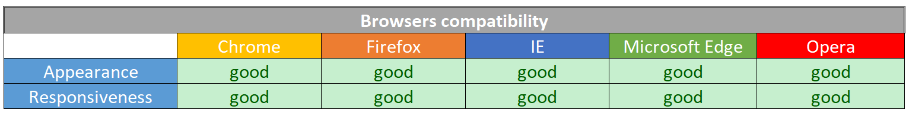

<h1 align="center">4. Testing</h1>

This file is the forth chapter of the full README file. Click here to go to [README.md](./README.md)

# Table of contents

1. [Code Validators](#Code-Validators)
2. [Responsiveness](#Responsiveness)
3. [Browsers compatibilty](#Browsers-Compatibilty)
4. [Testing User Stories](#Testing-User-Stories)
5. [Testing Defensive Design](#Testing-Defensive-Design)
6. [Bugs](#Bugs)

# Code Validators

### [W3C HTML Validator]():

In all the files, everytime [Jinja](https://jinja.palletsprojects.com/en/2.11.x/) was used, it was reported as an error.

Also, in the index file, an attribute of the map that connected to the tooltip was considered wrong.

Apart this, small problems have been found, like a missing closing tag and a typo in an attribute, those were immediately corrected.

### [W3C CSS Validator](https://jigsaw.w3.org/css-validator/):

In the CSS file, no errors have been found.

### [JS Hint](https://jshint.com/)

JS Hint revealed 2 warnings and 1 undefined variable in script.js.

## [PEP8](http://pep8online.com/)

The PEP8 validator revealed no errors.

# Responsiveness

Below you can find the list of the devices where the website is been tested.
In order to test the responsiveness, is been used [Chrome DevTools]() and [Responsive Design Checker]().
This table is been realized with [Microsoft Excel](https://www.microsoft.com/en-us/microsoft-365/excel).

**Notes**

In 4 pages, the logo and shortcut icon doesn't display (both on the navigation bar and the side menu).

# Browsers Compatibility

This website is been used on 5 different browser manually.
Here below you can find the table with the results.
This table is been realized with [Microsoft Excel](https://www.microsoft.com/en-us/microsoft-365/excel).

# Testing User Stories

**Website**

1. As a user (not Italian) I want to be able to consult the website and find traditional Italian recipes so I can try to make them at home.

If I am a non Italian and I want to use Italian Inside, I could:

* Access Italian Inside
* Hover over the regions to learn some more about what are their most famous gastronomic products
* Then, click on "All Recipes"
* Scroll between the recipes, then click on my favorite one to view how to make it.
* Or, if I am looking for a particular recipe, I could write it in the search bar and see if somebody already added it.
* I can also consult the page about "Casale del Giglio" and go to look for a bottle of wine to pair with the selected dish.

2. As a user (Italian) I would like to share some traditional but not very known recipes of my region and learn about recipes from other regions.

As an Italian, I can follow all the steps above to see what recipes are on Italian Inside. Besides, I can also:

* Create a profile and add some recipes of my region.

**Homepage**

1. As a user, I would like to know more about italy, like some fun facts.

The user can hover with the mouse on the map and ready some news about regional products.

2. As a user I want to be able to easily access all pages of the website.

On top of this page, like in every other page, the user can view the other pages of the website and click on them.

**All Recipes**

1. As a user, if for example I am looking for a dessert, I want to go on the “All recipes” page and find the “Dessert” type recipes.

The user can click on the "All Recipes" page and browse between the recipes. To divide the categories, the background of every recipes is an image of that category. For example: the pasta categories has a picture with some "penne rigate" pasta, the meat has a picture with a steak and some rosemary, the fish has a picture with some fish, the pizza has an image with a pizza and the desserts category has an image with some macaroons.

2. As a user, if I am looking for a specific recipe I want to be able to find it by just typing its name in the search bar.

If the user is looking for a recipe in particular, he/she can type it in the search bar.

**Recipe View**

1. As a user when I click on a recipe I want to find all the information I need to understand what kind of recipe it is and how to prepare it.

When a user clicks on a recipe, he/she will be able to see: the name, the picture, the region, the difficulty level, the servings, the type of wine to pair with it, the ingredients list and the steps to prepare it.

**Casale del Giglio**

1. As a user, I want to know what is the best wine to pair with a recipe and buy a bottle of it.

The user can click on the Casale Del Giglio tab to read about this collaboration between the company and Italian Inside and can also click on a button to go to the company website and learn about their wines. (and, in case, buy them).

**Login / Registration**

1. As a user I want to have my personal access to the website so I can share my recipes with the other users.

The user can create a free profile that will allow him/her to add/edit/delete recipes.

**Profile**

1. As a user, I want to be able to review the recipes I uploaded, manage them and add more.

Once the user is registered or is logged in, he/she can add new recipes by clicking on the button. The user can also review the recipe in short from the profile and decide if to modifiy it or erase it.

**Admin objectives**

If the users are able to make all the actions explained above, that means that the admin reached her goals. The collaboration with the Casale Del Giglio company, will also allow the admin to make some profit from the sell of wine bottles via Italian Inside.
The admin has also a powerful login credential that allows her to view all the recipes that have been added, to edit or delete them.

# Testing Defensive Design

The users will have to respect the defensive design added to input fields, text areas and dropdown options. If they will not, the website will not allow them to go ahead with the desired action like edit a recipe or logging in.
Moreover, the 404 error handler makes sure that, if a user try to access a private area of the page without loggin in before, a message will inform them that the page was not found and will give them the possibility to click on a button to go back to the homepage.

# Bugs

Being this my first full stack project, I encountered some bugs. Some I managed to solve but some not.
Here is a list:

* On the homepage I wanted to display an interactive map of Italy. However, it was my first time working with a graphic element. I converted it to more different formats to see what was the best one for my scope. At the end I decided to leave in svg.
Also applying the tootips got me a lot of time. The map at the moment is working properly and the tooltips are displaying correctly. The only bug still existent is the fact that the tooltips influence the z-index of the map. So, if the user hover on the map, it will display on top of the navbar till the user will click back on another area of the same page. I hope I will solve this bug in future.

* Another bug I found in the map is that I could not use jinja to retrieve the database information to write in its tooltips. I tried to change the code more time but it continue to change that map itself. Sometime the map was showing upside down, other times it was displayed 20 times, one time for every region.
At the end I decided to write the text by hand but I left the database regions.famous_for in, so maybe in the future I will be able to find a solution to this.

* I also had a bug with the search bar that didn't work properly. I discovered that problem was that my recipes underneath were divided into more collections with header for every category. I solved this by getting rid of the category names and displaying them just as a background for the recipes.

* The last bug is that logo and shortcut icon do not display in the following pages: Recipe View, Profile, Edit Recipe and 404 handlers (in small devices the logo also disappeared in the side menu). I could not find an explaination for this. Can be dependent on the python code made to retrieve the database information.

[Go back to the top](#Table-of-contents)